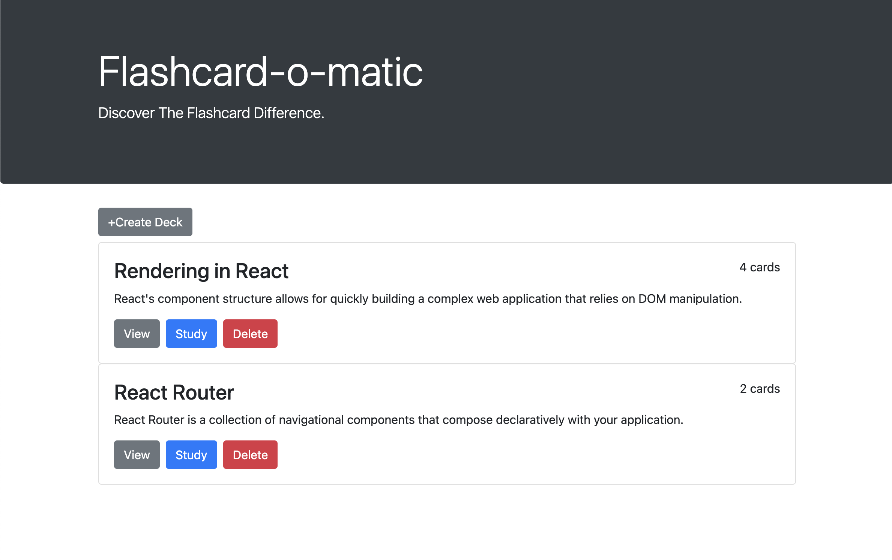
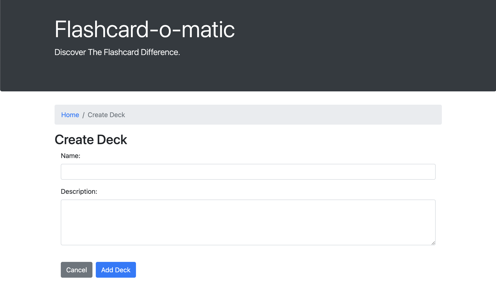
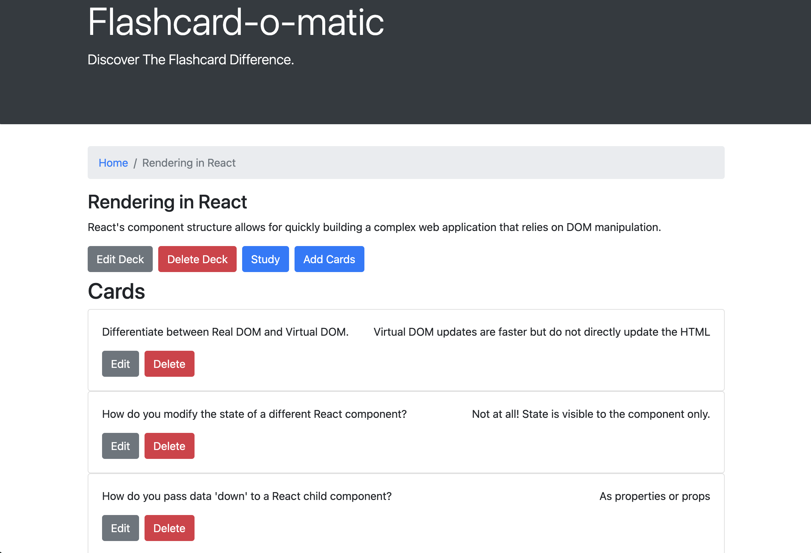
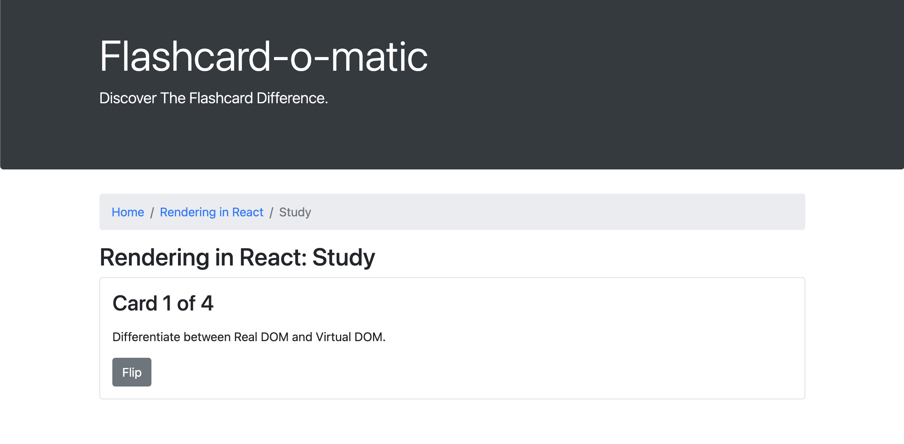
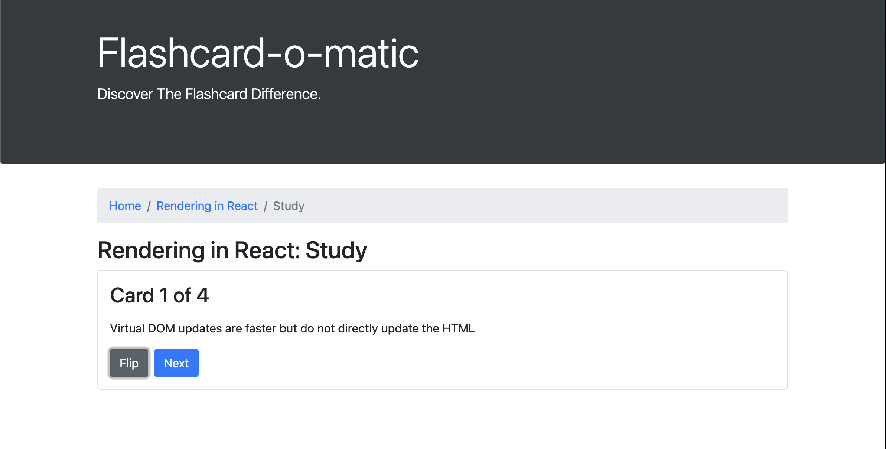
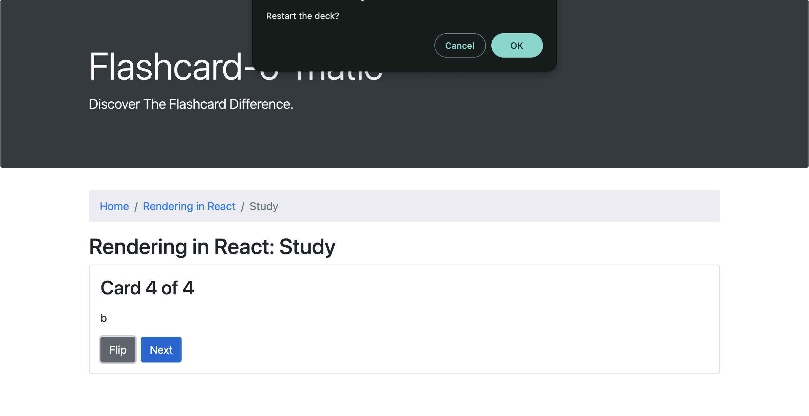
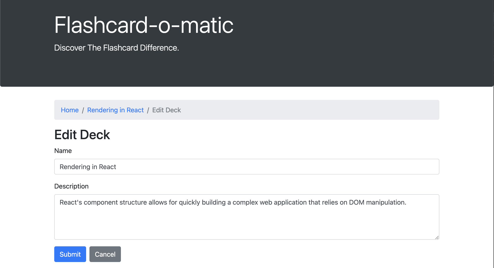
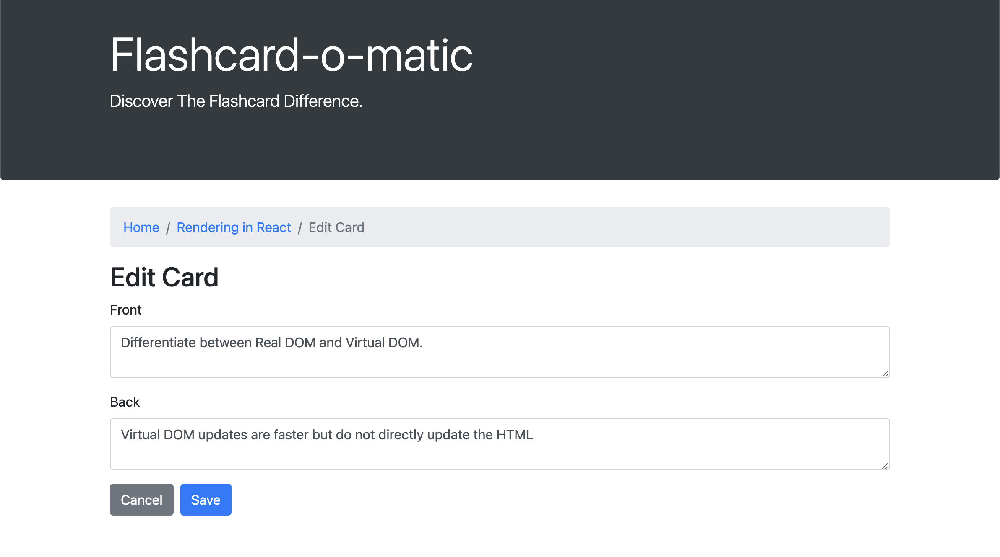
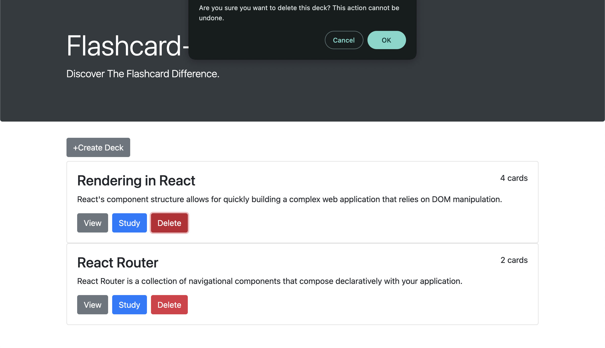
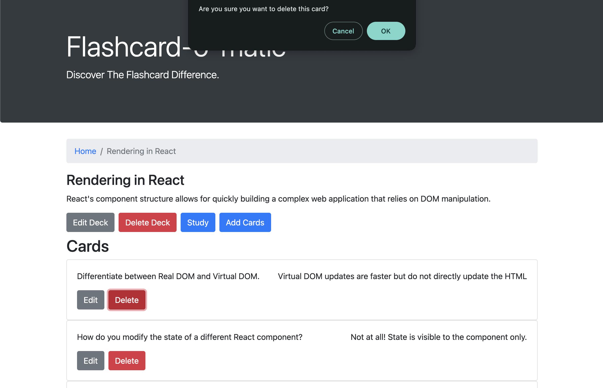

# Flash-O-Matic App
This application lets users create, view, and edit flashcards and decks. Decks, which are groups of flashcards, can be created without limit, helping users to focus on specific study topics. The application’s data storage is handled by Json-Server, which runs alongside the 'Flashcard' client.

## Tools
- React.js
-JavaScript
- HTML
- CSS
- Bootstrap
- Json-Server

## Screenshots
### Home Page
The 'Home Page' provides an overview of all available decks and includes several control buttons.

The 'Create Deck' button allows users to create a new deck.

Within each deck, there are 'View', 'Study', and 'Delete' buttons.

The 'View' button takes users to a new page where they can see the collection of flashcards within the deck. The 'Study' button lets users go through each flashcard in the deck. The 'Delete' button removes the deck.

### Create Deck Page
On the 'Create Deck Page,' users can enter the name and description of the new deck. They have the option to either cancel the deck creation or submit it.

### View Deck Page
The 'View Deck Page' shows the deck's name and description, along with the collection of flashcards in that deck.

The 'Edit' button navigates the user to the respective edit page for the deck or individual cards, allowing modifications to be made.

The 'Study' button lets the user review all the cards in the deck, displaying the front (question or term) and back (answer or definition) of each card.

### Study Deck Page
When the user clicks the 'Study' button on the Home page or the View Deck page, they will be directed to the 'Study Deck Page.'

The following three screenshots illustrate the initial, middle, and final stages of the user's experience as they review the cards in a deck.

1. The user first sees the front side of a card along with a 'Flip' button, which allows them to view the backside of the card. If the backside is already displayed, the 'Flip' button will return to showing the front side.

3. As the user progresses through the cards but has not yet reached the end of the deck, they will see both a 'Flip' button and a 'Next' button. The 'Flip' button lets the user toggle between the front and backside of a card, while the 'Next' button moves them to the next card in the deck.

5. When the user reaches the end of the deck, a pop-up alert will appear, asking if they would like to start studying the cards from the beginning or exit the study session.

### Edit Deck Page
The 'Edit Deck Page' enables users to modify the Deck Name and Description. Users can either cancel or submit the changes.

### Edit Card Page
The 'Edit Card Page' enables users to modify the Front and Back of a card. Users can either cancel or submit their changes.

### Delete Deck Pop-up Box
When the user clicks the 'Delete' button on the Home Page or the Deck page for any individual deck, an alert box will appear.

### Delete Card Pop-up Box
When the user clicks the 'Delete' button for any individual card within a deck, an alert box will appear. Cards can only be deleted while on the Deck page of each specific deck.

